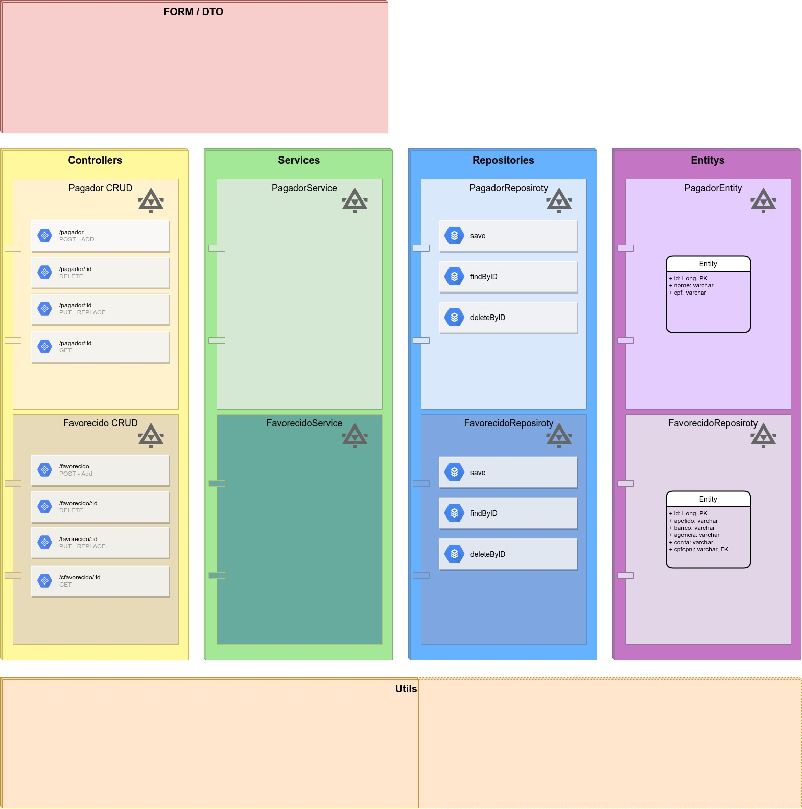
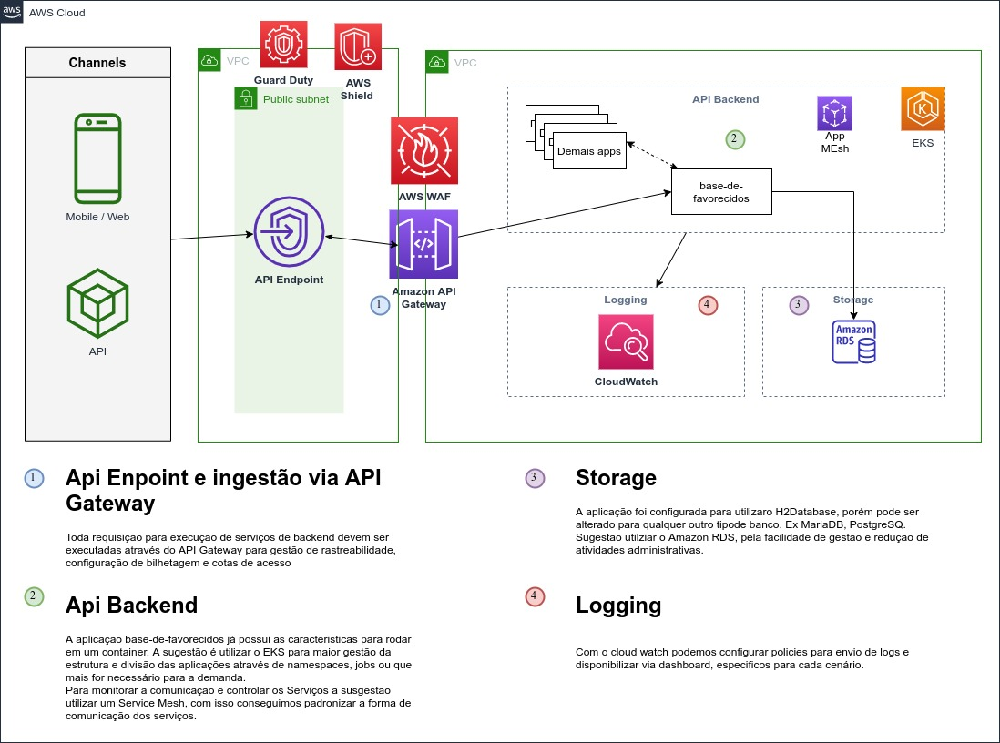

# Projeto simples de cadastro de base-de-favorecidos

Objetivo: cadastrar o pagador e cadastrar favorecidos referentes ao pagador. 

### Tecnologias 

* Spring Boot
* Spring JPA
* Swagger
* Spring Boot Test
* Spring Boot Actuator - Health Check
* h2database
* Maven
* Docker 

#### Executar o projeto

Gerar o build do projeto.
```Linux
mvn clean package
```
Gerar o build da imagem docker
```Linux
docker build -t base-de-favorecidos:v0.0.0 .
```
Executar o projeto
```Linux
docker run -p 8080:8080 base-de-favorecidos:v0.0.0
```

URL: http://localhost:8080/swagger-ui.html

#### Modelo JAVA

No exemplo abaixo, está o modelo utilizado pelo projeto. As camadas Services e Utils, não foram implementadas neste projeto.



#### Arquitetura de sugestão AWS

